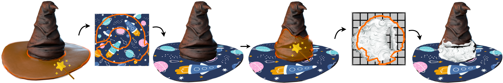

# DA Wand [[Project Page](https://threedle.github.io/DA-Wand/)][[Blender Extension](https://extensions.blender.org/approval-queue/da-wand/)]
[](https://drive.google.com/file/d/1OkGwIPQb9RUeT5aw-X_tdBAPG0bB4dNQ/view)




Code for "DA Wand: Distortion-Aware Selection using Neural Mesh Parameterization" [CVPR 2023]

## ⭐️ Blender Extension ⭐️
We have a Blender extension available! You can install it directly from the [extensions store](https://extensions.blender.org/approval-queue/da-wand/) or from the [github repo](https://github.com/threedle/DAWand-Blender). We have also made available a [features tutorial](https://youtu.be/eHOW__7vnmQ) and [texturing video](https://youtu.be/uyY2FZG5ON4) for helping you incorporate the tool into your texturing pipelines.  

https://github.com/user-attachments/assets/b66537a4-4f9a-4595-ba66-99f2b80f24c5

## Getting Started
### Installation
```
# With GPU 
conda env create --file dawand.yml
conda activate dawand

# Without GPU 
conda env create --file dawand_cpu.yml
conda activate dawand
```
To install pygco, go into the `gco_python` folder and run `make`, then run `python setup.py install`. If you experience any issues please refer to the [gco_python repo](https://github.com/amueller/gco_python).

### System Requirements
- Python 3.7
- CUDA 11
- 16 GB GPU (for training)
- Blender 3.3.1 (for synthetic dataset generation)

## Training
### Download original training data from paper 
[Initial Primitives](https://drive.google.com/file/d/1Q2GdCjp59of64rrFrMqZCNAPV9QGOrKQ/view?usp=sharing)

[Synthetic Dataset](https://drive.google.com/file/d/112tUBhhm5v4ZPIvSYYwRCk2kJL09cP-D/view?usp=sharing)

[Distortion Self-Supervision Dataset](https://drive.google.com/file/d/1CjjlwzZdugoMhSnWHTTUcT5F6wrcJGgv/view?usp=sharing)

To train, simply provide the path to the dataset folder as inputs to the argument `--dataroot` and the path to the test subfolder to the argument `--test_dir`. Set `--gpu_ids` to -1 if training without a GPU. See the `scripts` folder for example commands for training the network with the same parameters as in the paper. 

### Generate Synthetic Dataset 
Call the script in `./scripts/generate_synthetic_data.sh` to generate the synthetic dataset using the procedure outlined in the paper. The data will be stored in `./datasets/synthetic_data`. 

To generate the deformed primitives with custom parameters, you will need to have Blender 3.3.1 installed and available in PATH. From there, you can generate random deformed primitives using the primitives provided in `datasets/primitives` by calling 
```bash
blender --background --python blender_deform.py --datadir ./datasets/primitives --outdir ./datasets/deformed_primitives ... 
```
This will generate a set of deformed primitives with the same ground truth near-developable decompositions. Refer to the `blender_deform.py` file for the adjustable parameters for generating the synthetic data. 

After generating the deformed primitives, you can call `generate_synthetic_data.py` with custom parameters to construct the synthetic dataset with randomly sampled selection points and ground truth labels.  

### Build your own natural shape dataset 
The differentiable parameterization layer enables training DA Wand over any arbitrary set of meshes. Creating a dataset for distortion self-supervised training is simple. 

1. Create a folder with the name of the dataset, with subfolders `train` and `test` Split your training meshes between the `train` and `test` folders. 
2. For each mesh in the subfolders, sample selection points as desired into a **Python list** and use `dill` to save them as pickled files in a folder titled `anchors`. The name of the pickled files should be `{name of obj}.pkl`. There should be separate `train/anchors` and `test/anchors` folders. 
3. To incorporate mixed training with ground truth labels, copy the respective labelled meshes into the `train` and `test` folders, copy their anchor `.pkl` files into the `anchors` subfolder, and create a new folder titled `labels` to store the labels. Each label file should be a binary numpy array with the same length as the number of mesh triangles. The label files should be titled by `{name of obj}{anchor index}.npy`, where the anchor index is the index of the respective selection point from the mesh selection point list saved in `anchors`. 
To train with mixed data, simply pass the flags `--supervised --mixedtraining` into the `train.py` call. 

## Interactive Demo 
https://user-images.githubusercontent.com/29670153/206595632-de8bd95c-d8f2-4fc4-9b62-c7a2e7663c16.mp4

The interactive demo was created using [Polyscope](https://github.com/nmwsharp/polyscope). To run the demo, run the following command 
```bash
python interactive.py --modeldir ./checkpoints --modelname dawand --meshdir {path to obj file} --meshfile {name of obj file}
```
To use a different DAWand model, simply change the inputs to `modeldir` and `modelname`. The application will expect the model weights to be saved with the naming convention `{modelname}_net.pth`

**Note:** DA Wand is trained on meshes within a restricted edge range (5000 - 12,000), and will be mostly effective on meshes within that range. For meshes of lower or higher resolution, we recommend either remeshing or retraining the model to meet the desired the resolution. 

## Acknowledgements
The implementation code for DA Wand relies on a number of excellent public source projects for geometry processing, analysis, and visualization. These projects are acknowledged below:
- [libigl](https://github.com/libigl/libigl-python-bindings/)
- [MeshCNN](https://github.com/ranahanocka/MeshCNN/)
- [PyMesh](https://github.com/PyMesh/PyMesh)
- [DiffusionNet](https://github.com/nmwsharp/diffusion-net)
- [Polyscope](https://github.com/nmwsharp/polyscope)
- [PyVista](https://github.com/pyvista)
- [Parameterization Benchmark](https://github.com/georgiashay/parameterization_benchmark)

## Citation
```
@article{liu2022dawand,
         author = {Liu, Richard and Aigerman, Noam and Kim, Vladimir G. and Hanocka, Rana},
         title  = {DA Wand: Distortion-Aware Selection using Neural Mesh Parameterization},
         journal = {arXiv},
         year = {2022}
         }
```
